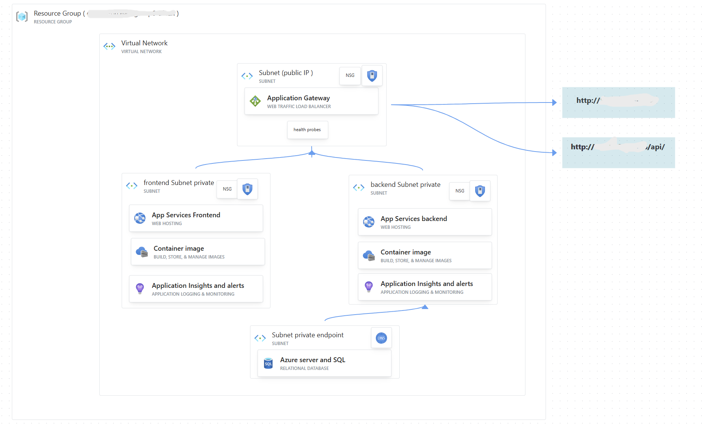

# DevOps Project 2 - Azure Web App Infrastructure and Deployment

## Project Overview

This project automates the provisioning, deployment, and monitoring of a **frontend-backend web application** on **Azure** using **Terraform** and **GitHub Actions**, leveraging **Docker containers** for CI/CD.

### Resources 


- **Resource Groups, VNets, Subnets, NSGs** for networking and organization.
- **Azure App Services** for frontend and backend.
- **Application Gateway** for load balancing and secure traffic.
- **SQL Database** for backend storage.
- **Log Analytics & Application Insights** for monitoring.
- **Alerts & Action Groups** for key metrics notifications.


### Alerts and Monitoring

- **Application Gateway:** backend health < 100%.
- **App Services:** CPU > 70% for 5 min.
- **SQL Database:** CPU/DTU/vCore > 80% or failed requests.
- **App Insights:** tracks requests, failures, dependencies, memory, response time.

Notifications are sent via **email**.

### Docker Images

- **Backend:** Java + Maven, pushed to DockerHub.
- **Frontend:** Node.js, API base URL set to App Gateway IP, pushed to DockerHub.

### Continuous Deployment

Workflows automate:

- Terraform infrastructure provisioning (`infra.yml`)
- Backend build & Docker push (`backend.yml`)
- Frontend build & Docker push (`frontend.yml`)
- Live variable injection (e.g., App Gateway IP)

This ensures a fully automated and reproducible environment.


## Prerequisites

Before you can provision and deploy this project, ensure you have the following in place:

1.  **Azure Subscription**: An active Azure subscription with sufficient permissions to create resources.
2.  **Azure CLI**: Installed and configured on your local machine to authenticate with Azure.
3.  **Permissions**:
    *   **Service Principal**: A service principal with `Contributor` or similar permissions on the target Azure subscription or resource group. This is used by the GitHub Actions to authenticate and manage resources.
    *   **User Permissions**: Ensure your personal Azure account has permissions to manage resources.
4.  **Budgets/Quotas**: Confirm that your subscription has adequate quotas for the resources being provisioned, such as virtual machines, databases, and network components.
5.  **GitHub Secrets**: Configure the following secrets in your GitHub repository settings under `Settings > Secrets and variables > Actions`:
    *   `AZURE_CREDS`: The credentials JSON for your Azure service principal.
    *   `ARM_SUBSCRIPTION_ID`: Your Azure subscription ID.
    *   `DOCKERHUB_USERNAME`: Your Docker Hub username.
    *   `DOCKERHUB_TOKEN`: A Docker Hub access token.
    *   `db_password`: The password for the SQL database.
    *   `db_admin`: The admin username for the SQL database.
    *   `STORAGE_RG`: The name of the resource group for the Terraform state storage.
    *   `STORAGE_AC`: The name of the Azure Storage account for the Terraform state.
    *   `BLOB_CON`: The name of the blob container for the Terraform state.
    *   `KEYTF`: The key for the Terraform state file (e.g., `devops-project2.tfstate`).
    *   `resource_prefix`: A prefix for naming all resources.
    *   Other Terraform variables as defined in `infra/variables.tf`.

## How to Provision (Terraform)

The infrastructure for this project is defined in the `infra` directory using Terraform. The provisioning process is automated via a GitHub Actions workflow.

1.  **Configure Terraform Backend**: The Terraform state is stored remotely in an Azure Storage account. Ensure the resource group, storage account, and container are created beforehand. The workflow in `.github/workflows/infra.yml` is configured to use this remote state.
2.  **Trigger the Workflow**: Navigate to the `Actions` tab in your GitHub repository, select the `infrastructure` workflow, and manually run it using `workflow_dispatch`. Alternatively, a push to the `infra/**` directory will automatically trigger this workflow.
3.  **Monitor the Deployment**: The GitHub Actions workflow will perform `terraform init`, `terraform plan`, and `terraform apply`. Monitor the job logs to ensure all resources are created successfully. The plan includes retries to handle transient errors.

## How to Deploy (GitHub Actions)

The application deployment is handled by separate GitHub Actions workflows for the backend and frontend. These workflows build and push Docker images to Docker Hub and then pass the image tags to the infrastructure workflow for deployment to Azure App Service.

1.  **Deploy Backend**:
    *   The `backend.yml` workflow is triggered by pushes to the `backend/**` directory or can be run manually.
    *   It builds the Spring Boot application using Maven, creates a Docker image, and pushes it to Docker Hub with the `latest` tag.
    *   This image is then referenced by the infrastructure workflow (`infra.yml`) to update the Azure App Service.

2.  **Deploy Frontend**:
    *   The `frontend.yml` workflow is triggered by pushes to the `frontend/**` directory or can be run manually.
    *   It builds the React application, creates a Docker image, and pushes it to Docker Hub.
    *   The build process includes a build argument `VITE_API_BASE_URL` to configure the backend API endpoint. The workflow retrieves the public IP of the Application Gateway to set this value.

## How to Validate

After the infrastructure is provisioned and the applications are deployed, you can validate the deployment.

1.  **Get Application URLs**: The Terraform output `agw_ips` provides the public IP address of the Azure Application Gateway. This is the main entry point for your application. You can find this output in the logs of the `infrastructure` workflow run.
2.  **Test the Application**: Open the public IP address in a web browser to access the frontend. The frontend should be able to communicate with the backend through this gateway.
3.  **Sample Validation (using `curl`)**:
    *   **Check Frontend**: Use `curl` to verify that the web application is serving a response.
        ```sh
        curl http://<Application-Gateway-IP>
        ```
    *   **Check Backend API**: Use `curl` to test an API endpoint, for example, a health check or a sample endpoint.
        ```sh
        curl http://<Application-Gateway-IP>/api/health
        ```
    *   Replace `<Application-Gateway-IP>` with the actual IP address retrieved from the Terraform outputs.
